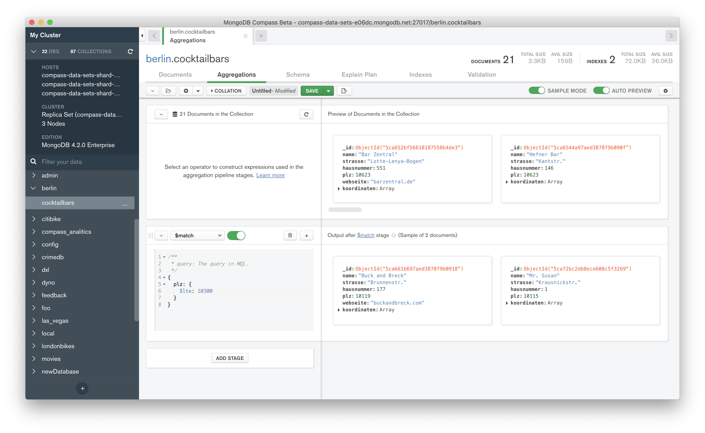

# MongoDB Compass Monorepo

This repository contains the source code and build tooling used in [MongoDB Compass](https://www.mongodb.com/products/compass).

## Available Scripts

In the project directory, you can run:

To install all dependencies first run: 
### `npm install` 

Create file .env with:
---------------
* PORT= 4001
* MONGODB_URI= "mongodb://localhost/bastodb"
* CLIENT_URL= "http://localhost:3000"

To start run:
### `npm start`

and run npm test to check test:
### `npm test`

Runs the app in the development mode.\
Open [http://localhost:4001](http://localhost:4001) to view it in your browser.

The page will reload when you make changes.\
You may also see any lint errors in the console.
